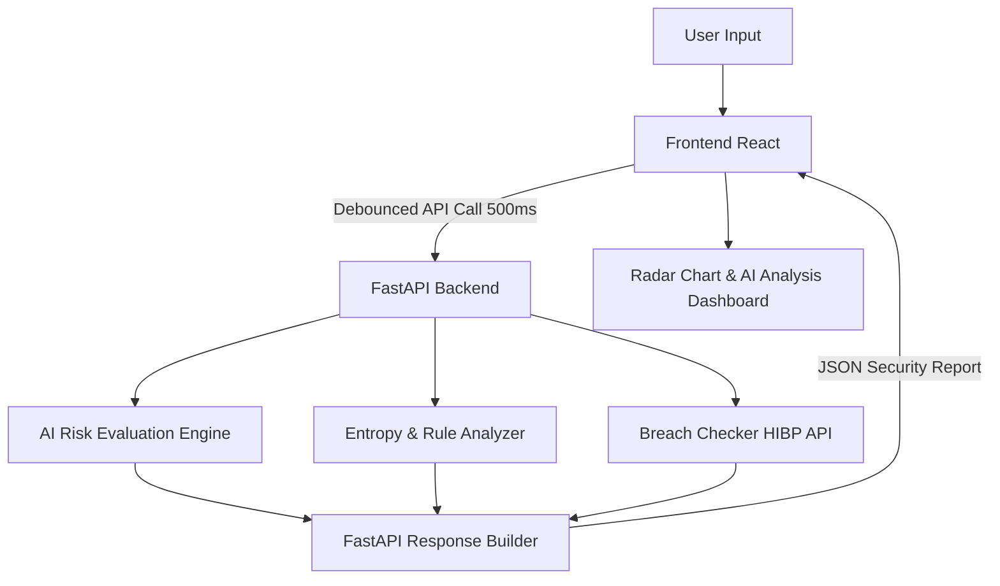

# AI-Powered Password Strength Analyzer

An advanced, cybersecurity-focused password analyzer featuring real-time AI risk assessment, Shannon entropy calculation, Have I Been Pwned breach detection, and dynamic security recommendations. Styled with a premium cyberpunk/dark-themed neon UI.

## Features
- **Real-Time AI Risk Prediction**: Evaluates password risk using a trained Random Forest Classifier model. Returns confidence, pattern type, risk levels, and attack vectors.
- **Rule-Based Validation**: Scores passwords out of 100 based on composition rules (uppercase, lowercase, numbers, special characters, and length).
- **Shannon Entropy Calculation**: Computes password strength in bits of entropy to measure unpredictability.
- **Data Breach Checking**: Connects securely to the Have I Been Pwned API using **k-Anonymity** (hashes password with SHA-1 and sends only the first 5 characters to preserve privacy).
- **Password Generator**: Generates cryptographically secure, highly complex passwords on demand.
- **Interactive Metrics Dashboard**: Visualizes strength factors using Radar charts and neon statistics cards.

## Tech Stack
*   **Frontend**: React (Vite), Tailwind CSS (v4), Recharts (Metrics Radar Chart), Framer Motion, Lucide Icons, Axios.
*   **Backend**: Python, FastAPI, Uvicorn, Pydantic, Requests.
*   **AI/ML**: Scikit-Learn (Random Forest Classifier), Pandas, NumPy, Pickle.

## Architecture

```text
User Input
    ↓
Frontend (React)
    ↓
FastAPI API
    ↓
AI Engine
    ↓
Entropy + Breach Analysis
    ↓
Security Report
```

### Flow Diagram (Mermaid)


## Screenshots
*(Add screenshots here)*


## Installation
Follow these instructions to run the application locally on your system:

### Prerequisites
- Node.js (v18+)
- Python (v3.8+)

### Setup Instructions

1. **Clone the repository**:
   ```bash
   git clone https://github.com/ilayabharathi-cs/AI-Powered-Password-Strength-Analyzer.git
   cd AI-Powered-Password-Strength-Analyzer
   ```

2. **Backend Setup**:
   ```bash
   cd backend
   python -m venv venv
   # On Windows (PowerShell):
   Set-ExecutionPolicy -ExecutionPolicy Bypass -Scope Process
   .\venv\Scripts\activate
   # On Windows (CMD):
   venv\Scripts\activate.bat
   # On macOS/Linux:
   source venv/bin/activate

   pip install -r requirements.txt
   ```

3. **Frontend Setup**:
   ```bash
   cd ../frontend
   npm install
   ```

## Usage

### Running Locally
To launch both components at once on Windows, you can double-click **`run_local.bat`** in the project root folder.

Alternatively, you can run them manually in separate terminal panels:

1. **Start Backend Server**:
   Inside the `backend` folder:
   ```bash
   .\venv\Scripts\python.exe -m uvicorn main:app --reload
   ```
   API runs at `http://localhost:8000`.

2. **Start Frontend Server**:
   Inside the `frontend` folder:
   ```bash
   npm.cmd run dev
   ```
   The site runs at `http://localhost:5173`. Open this URL in your web browser.

## Security Features
- **In-Memory Analysis**: Passwords are analyzed in-memory and are never saved or written to databases or logs.
- **k-Anonymity Privacy Model**: When checking for breaches, only the first 5 characters of the SHA-1 hashed password are transmitted over the network to the HIBP API. This ensures the password can never be intercepted or reconstructed.
- **Debounced Requests**: The frontend delays API requests by 500ms as the user types. This prevents server overloading and protects against brute-forcing.

## Future Improvements
- **Local Dictionary Lists**: Implement dictionary word check locally using a trie data structure.
- **OAuth Integration**: Allow secure authentication checking for saved user credentials.
- **Multi-lingual Security Tips**: Add suggestions in localized languages.
- **Offline Mode**: Cache HIBP ranges to perform offline audits.
